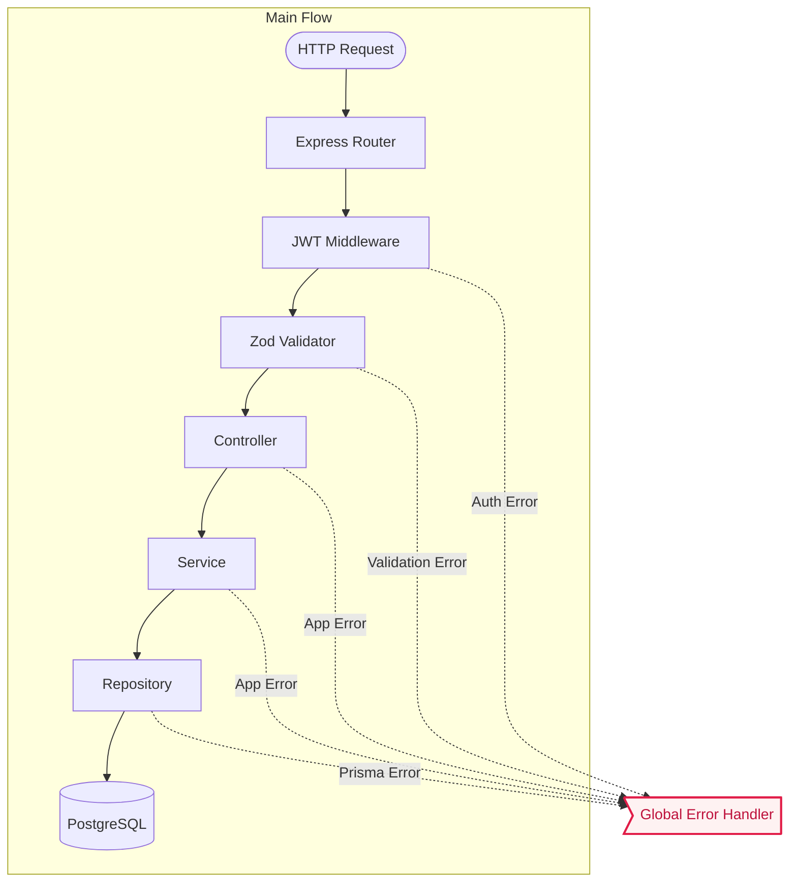
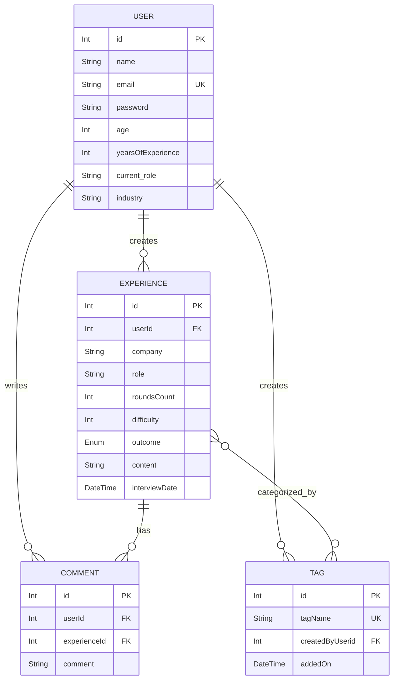

<div align="center">

# 🚀 Interview Experiences API

A robust, type-safe, and highly scalable RESTful API built to share, manage, and explore technical interview experiences.

<div style="display: flex; justify-content: center; gap: 8px; flex-wrap: wrap; margin-bottom: 16px;">
  
  
  
  
  
  
  
</div>

**CLEAN CODE • FEATURE-BASED ARCHITECTURE • STRONGLY TYPED**

<div align="center">

---

<div align="center"> 
  
🟢 **Live API URL:** [https://interview-experiences-api.onrender.com/](https://interview-experiences-api.onrender.com/)

<div align="center">

---

## 💡 What is this?

The **Interview Experiences API** is a backend service designed to empower professionals and freshers to document and learn from technical interview encounters. Built with a strict **TypeScript** foundation, this API leverages **Express.js** for routing, **JWT** for authentication, **Prisma ORM** for seamless database interactions with **PostgreSQL**, and **Zod** for bulletproof data validation.

## ✨ Key Features

* **🔐 Secure Authentication:** JWT-based authentication with secure, HTTP-only cookie delivery and password hashing using `bcryptjs`.
* **🛡️ Strict Type Safety & Validation:** End-to-end type safety. Every request parameter, query, and body is rigorously validated at runtime using dedicated `Zod` middlewares.
* **🏗️ Feature-Driven MVC Architecture:** Code is logically grouped by feature (`auth`, `users`, `experiences`, `comments`, `tags`) rather than by generic types, promoting incredible scalability and maintainability.
* **🚦 Centralized Error Handling:** A global error handler that seamlessly intercepts and standardizes database errors, validation errors, and custom operational exceptions.

## 🛠️ Tech Stack

| Category | Technology |
| :--- | :--- |
| **Runtime / Core** | Node.js, TypeScript |
| **Web Framework** | Express.js (v5) |
| **Database & ORM** | PostgreSQL, Prisma |
| **Validation** | Zod |
| **Security & Auth** | JSON Web Tokens (JWT), bcryptjs, cookie-parser |

## 🚦 Request Processing Pipeline

The API operates a unidirectional pipeline to ensure no corrupt or unauthenticated execution blocks hit your business logic.



## 🛡️ Data Validation & Error Handling

This API implements a resilient, crash-proof error-handling strategy directly tied into the pipeline above:

* **Zod Validation (`middlewares/zod.ts`)**: Automatically intercepts bad requests before they reach the controller, returning detailed field-level error messages (e.g., `400 Bad Request`).
* **Global Error Handler (`middlewares/error.handler.ts`)**: Catches all unhandled exceptions, formats Prisma database errors (like `P2002` unique constraint violations or `P2025` record not found), and ensures a standard JSON response structure is always returned to the client.
* **Custom `AppError`**: Thrown within services for business logic constraints (e.g., `403 Forbidden` if a user tries to edit an experience they don't own).

## 🗄️ Database Schema

The database is built on PostgreSQL with Prisma managing the relational integrity.



## 🚀 Getting Started

### Prerequisites

* **Node.js** (v18 or higher recommended)
* **PostgreSQL** installed and running locally.

### Installation & Setup

**1. Clone & Install:**

```bash
git clone [https://github.com/iamkgehlot/interview-experiences-api.git](https://github.com/iamkgehlot/interview-experiences-api.git)
cd interview-experiences-api
npm install
```

**2. Database & Environment:**

Setup your `.env` file, then run migrations:

```bash
npx prisma generate
npx prisma migrate dev
npm run dev
```

## 📡 API Endpoints Summary

All routes are prefixed with `/api`. *Note: Protected endpoints require a valid JWT token.*

| Method | Endpoint | Description | Protected |
| :--- | :--- | :--- | :---: |
| **POST** | `/api/register` | Register a new user | ❌ |
| **POST** | `/api/login` | Login & receive JWT cookie | ❌ |
| **POST** | `/api/logout` | Clear auth cookies | ❌ |
| **GET** | `/api/users` | Fetch all users | 🔒 |
| **GET** | `/api/users/:id` | Fetch specific user | 🔒 |
| **PATCH** | `/api/users/:id` | Update user profile | 🔒 |
| **GET** | `/api/experiences` | Fetch all experiences | 🔒 |
| **GET** | `/api/experiences/:experienceId` | Fetch specific experience | 🔒 |
| **GET** | `/api/users/:userId/experiences` | Fetch user's experiences | 🔒 |
| **POST** | `/api/users/:userId/experiences` | Create a new experience | 🔒 |
| **PATCH** | `/api/experiences/:experienceId` | Update an experience | 🔒 |
| **GET** | `/api/experiences/:experienceId/comments` | Get comments for an experience | 🔒 |
| **GET** | `/api/users/:userId/comments` | Get all comments by user | 🔒 |
| **POST** | `/api/experiences/:experienceId/comments` | Add comment to an experience | 🔒 |
| **PATCH** | `/api/comments/:commentId` | Update a comment | 🔒 |
| **GET** | `/api/tags/` | Get all tags | 🔒 |
| **GET** | `/api/tags/:tagId` | Get tag by ID | 🔒 |
| **POST** | `/api/tags/` | Create a tag | 🔒 |
| **PATCH** | `/api/tags/:tagId` | Update a tag | 🔒 |
| **DELETE** | `/api/experiences/:experienceId` | Delete an experience | 🔒 |
| **DELETE** | `/api/comments/:commentId` | Delete a comment | 🔒 |
| **DELETE** | `/api/tags/:tagId` | Delete a tag | 🔒 |
| **DELETE** | `/api/users/:id` | Delete user profile | 🔒 |

<br>

<div align="center">
  <em>Engineered with Precision & Energy ⚡</em>
</div>
